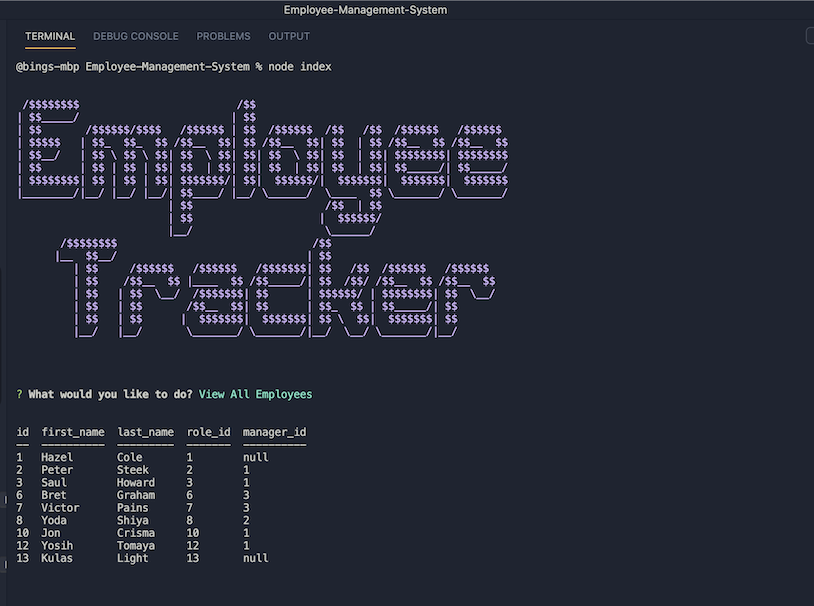
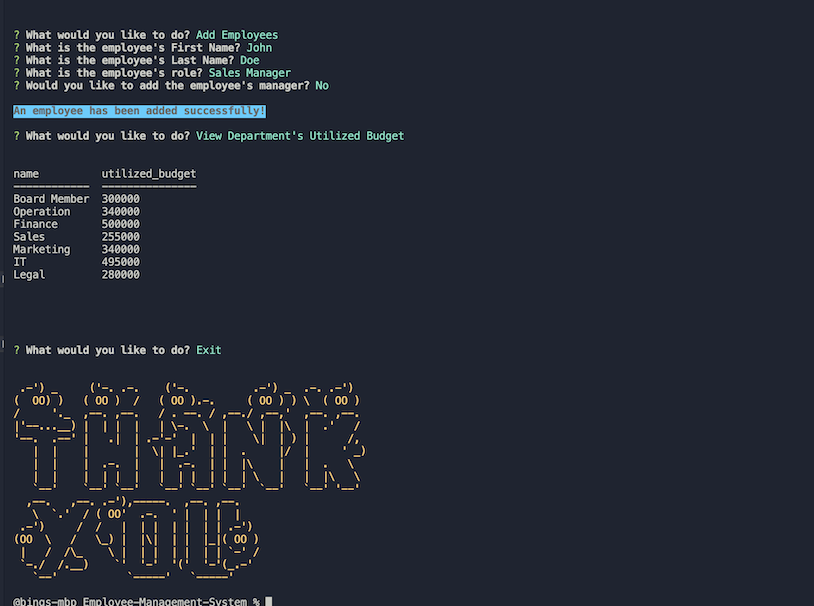

# Employee-Management-System
<hr>

  [](https://github.com/imbingz)
  [](https://github.com/imbingz/Employee-Management-System)
  [](https://github.com/imbingz/Employee-Management-System)
  [](https://choosealicense.com/licenses/mit/)
  [](https://nodejs.org/en/)
  [](https://www.npmjs.com/package/inquirer)

  ## Table of Content
  * [ Project Links ](#Project-Links)
  * [ Screenshots-Demo ](#Screenshots-Demo)
  * [ Project Objective ](#Project-Objective)
  * [ User Story ](#User-Story)
  * [ Technologies ](#Technologies)
  * [ Installation ](#Installation)
  * [ Usage ](#Usage)
  * [ Credits and Reference ](#Credits-and-Reference)
  * [ Tests ](#Tests)
  * [ Author Contact ](#Author-Contact)
  * [ License ](#License)
  #

  ##  Project Links
  https://github.com/imbingz/Employee-Management-System<br>
  https://youtu.be/wVnzS9pFouw


  ## Screenshots-Demo
  <kbd></kbd>
  <kbd></kbd><kbd></kbd>
  
  ## Project Objective
  Developers are often tasked with creating interfaces that make it easy for non-developers to view and interact with information stored in databases. The object is to architect and build a solution for managing a company's employees using node, inquirer, and MySQL.

  Build a command-line application that at a minimum allows the user to:
    * Add departments, roles, employees
    * View departments, roles, employees
    * Update employee roles
    * Update employee managers
    * View employees by manager
    * Delete departments, roles, and employees
    * View the total utilized budget of a department -- ie the combined salaries of all employees in that department
  
  ## User Story
  As a business owner, I want to be able to view and manage the departments, roles, and employees in my company So that I can organize and plan my      business. 

  ## Technologies 
  ```
  node.js, npm inquirer, mysql, Javascript
  ```
  
 ## Installation
   Access to GitHub.com and a code editor such as vscode is necessary. Click the GitHub link provided above to the APP REPO. Click on the green button    that says Clone or Download and Choose how you would like to download: using the SSH/HTTPS keys or download the zip file. If using SSH/HTTPS Key:   You will copy the link shown and open up either terminal (mac: pre-installed) or gitbash (pc: must be installed). Once the application is open, you   will type git clone paste url here. If using Download ZIP: Click on Download Zip. Locate the file and double click it to unzip the file. Locate the   unzipped folder and open it. 

 ## Usage 
 In order to use this APP, you need terminal (mac: pre-installed) or gitbash (pc: must be installed). You also need to download and install [node.js](https://nodejs.org/en/) and [npm](www.npmjs.com) or [yarn](https://yarnpkg.com/) package manager. Open the cloned REPO in your favorite code editor, make sure you download the package.json, then in terminal, enter the command “npm i" or "npm install"  to install the dependencies [inquirer package](www.npmjs.com/package/inquirer).  Now you are ready to start using  the app by entering “node index.js” on your terminal or gitbash. 
  
  ## Credits and Reference
  The following links have helped me with this project. <br> 
  [mysql2 Promise Wrapper](https://www.npmjs.com/package/mysql2#using-promise-wrapper) <br>
  [Node.js, MySQL and async/await](https://codeburst.io/node-js-mysql-and-async-await-6fb25b01b628) <br>
  [How to Interact With a Database Using Async Functions in Node.js](https://dzone.com/articles/how-to-interact-with-a-database-using-async-functi)     <br>
  [techonthenet.com](https://www.techonthenet.com/mysql/index.php)

  ## Tests
  npm test

  ## Author Contact
  Contact the author with any questions!<br>
  Github link: [imbingz](https://github.com/imbingz)<br>
  Email: contact.bingz@gmail.com

  ## License
  This project is [MIT](https://choosealicense.com/licenses/mit/) licensed.<br />

   Copyright © 2020 [BING Z](https://imbingz.github.io/Responsive-Website-Portfolio/)

  <hr>
  <p align='center'><i>
  This README was generated with ❤️ by <a href="https://imbingz.github.io/Responsive-Website-Portfolio/"> BING Z</a>
  </i></p>
